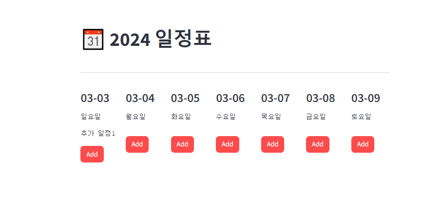

# Streamlit_Project

Streamlit과 Python을 이용해 원하는 기능 구현을 해보고자 했다.

나의 첫 목표는 일정 먼슬리 캘린더 제작이었으나, 구현의 난이도가 있어 위클리 캘린더로 변경하였다.

현재 첫 제작 이미지는 아래와 같다.

해당 프로젝트를 점점 발전시켜 나갈 예정으로, 현재 목표는 아래와 같다.

1. 코드 모듈화 하기
2. 일정 추가는 가능하지만 삭제 안되므로 체크박스로 삭제하는 기능 넣기
3. 계속해서 일정을 쓸 거라면 .json 파일 같은 거로 저장 기능 구현
4. 지난주, 다음주, 다다음주 일정을 볼 수 있는 버튼 구현
5. 계정별 데이터를 관리할 수 있도록 설정
6. 기능 구현이 끝나면 뭔가 예쁘게 꾸며보기
